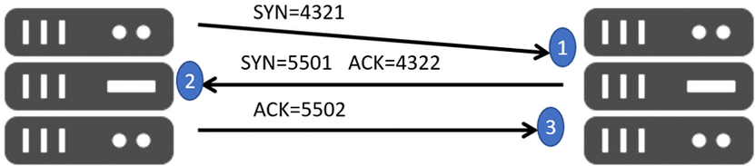

# Transmission Control Protocol (TCP)

TCP is a **connection based** protocol that occurs on the transport layer of the TCP/IP model. This means that it establishes an ordered  and reliable communication channel between the sender and receiver to ensure data delivery and integrity. *This comes at a cost of bandwidth* to do the error checking. You would want to use TCP in scenarios *where the loss of data cannot be tolerated* such as web browsing, file transfers or online banking.TCP is a connection based protocol. This means that it establishes an ordered and reliable communication channel between the sender and receiver to ensure data delivery and integrity. This comes at a cost of bandwidth to do the error checking. You would want to use TCP in scenarios where the loss of data cannot be tolerated such as web browsing, file transfers or online banking.[^1]

### Advantages

* Flow control (to avoid sending data too quickly)
* Error control
* Congestion control
* Process to process communication
* Inorder delivery of data segments

### Disadvantages

* The data segments don’t get transmitted immediately
* More overhead (20-60 Bytes)
* It has a large TCP Header

### TCP Header

<table>
  <tr>
    <td colspan="2" style="text-align:center">source port (16)</td>
    <td colspan="2" style="text-align:center">destination port (16)</td>
  </tr>
  <tr>
    <td colspan="4" style="text-align:center">sequence number (32)</td>
  </tr>
  <tr>
    <td colspan="4" style="text-align:center">acknowledgement number (32)</td>
  </tr>
  <tr>
    <td>header length (4)</td>
    <td>reserved (6)</td>
    <td>flags (6)</td>
    <td>window (16)</td>
  </tr>
  <tr>
    <td colspan="2" style="text-align:center">checksum (16)</td>
    <td colspan="2" style="text-align:center">urgent (16)</td>
  </tr>
  <tr>
    <td colspan="4" style="text-align:center">options</td>
  </tr>
  <tr>
    <td colspan="4" style="text-align:center">data</td>
  </tr>
</table>

Minimum: 20 bytes, Maximum: 60 bytes. _Table values expressed in bits_.

### 3-Way Handshake

The TCP 3-way handshake is a process which is used in a TCP/IP network to make a connection between the server and client. It is a three-step process that requires both the client and server to exchange synchronization and acknowledgment messages before the data exchange between two nodes can begin.[^2] The message types in the 3-way handshake are a described below:

| Message   | Description                                                                 |
| --------- | --------------------------------------------------------------------------- |
| `SYN`     |  Used to initiate the conncetion and sync sequence numbers between devices. |
| `ACK`     |  Confirms to the other side that it received the SYN.                       |
| `SYN-ACK` |  A SYN message from the local device and ACK of the previous packet.        |
| `FIN`     |  Used to terminate the connection.                                          |

When a packet is sent over TCP, the recipient must always acknowledge what they have received. The first computer sends a packet with data and a sequence number. The second computer acknowledges it by setting the ACK bit and increasing the acknowledgement number by the length of the received data. Those two numbers help the computers to keep track of which data was successfully received, which data was lost, and which data was accidentally sent twice.[^3] 

>1. **SYN**: The connection begins with the host sending the SYN packet to the destination. Inside the packet is a sequence number (4321) that indicates the beginning of the sequence numbers for the data that the host will transmit.
>2. **SYN-ACK**: The destination host receives the packet and responds with SYN and its sequence number (5501). The response also includes the includes the acknowledgement number, which is the origin host's sequence number plus 1 (4322).
>3. **ACK**: The origin host responds to the destination host with the sequence number plus 1 (5502). The SYN flag is set to 0 to indicate success.

### Flow Control

Two hosts engaging in a communication session may have different hardware. One might be faster than the other leading to a bottleneck. If the host can send 10 messages per second and the server can only handle 5 messages per second, at some point the servers message queue will be completely full.

With flow control, the server keeps sending the available space capacity for the incoming messages to the host during the communication. The server updates the space information and reduces the outgoing message rate as more messages accumulate. This space is known as the **window size**.

**Window size** is a parameter in the TCP header updated by both sides and represents the *maximum capacity available*. The window size value is zero when a receiver can not accept further messages which lets the sender know to stop sending messages. The sender can resume sending messages to the receiver when it gets a message with a window size that is greater than 0.[^4] 

### Lost Packets

TCP connections can detect lost packets by using a timeout. After sending off a packet, the sender starts a timer and puts the packet in a retransmission queue. If the timer runs out and the sender has not yet received an ACK from the recipient, it sends the packet again.
The retransmission may lead to the recipient receiving duplicate packets, if a packet was not actually lost but just very slow to arrive or be acknowledged. If so, the recipient can simply discard duplicate packets. 

### Packets out of Order

TCP connections can detect out of order packets by using the sequence and acknowledgement numbers. When the recipient sees a higher sequence number than what they have acknowledged so far, they know that they are missing at least one packet in between. The recipient lets the sender know there's something amiss by sending a packet with an acknowledgement number set to the expected sequence number.

[^1]: Kannan, V. (2023, August 14). _Demystifying networking from the perspective of a backend engineer_. Medium. [https://medium.com/@venkatramankannantech/demystifying-networking-from-the-perspective-of-a-backend-engineer-part-1-f2d1b9ddd7c5](https://medium.com/@venkatramankannantech/demystifying-networking-from-the-perspective-of-a-backend-engineer-part-1-f2d1b9ddd7c5)

[^2]: Leo, B. (2024, June 27). _TCP 3-Way Handshake (SYN, SYN-ACK,ACK)_. Guru99. [https://www.guru99.com/tcp-3-way-handshake.html](https://www.guru99.com/tcp-3-way-handshake.html)

[^3]: Transmission Control Protocol (TCP). (n.d.). _Transmission Control Protocol (TCP)_. Khan Academy. [https://www.khanacademy.org/computing/computers-and-internet/xcae6f4a7ff015e7d:the-internet/xcae6f4a7ff015e7d:transporting-packets/a/transmission-control-protocol--tcp](https://www.khanacademy.org/computing/computers-and-internet/xcae6f4a7ff015e7d:the-internet/xcae6f4a7ff015e7d:transporting-packets/a/transmission-control-protocol--tcp)

[^4]: What is the TCP flow control?. (n.d.). _What is the TCP flow control?_. CsPsProtocol. [https://www.cspsprotocol.com/tcp-flow-control/](https://www.cspsprotocol.com/tcp-flow-control/)