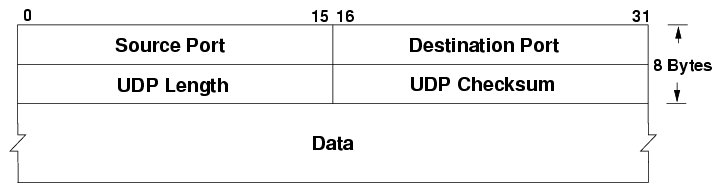

# User Datagram Protocol (UDP)

UDP is a **connectionless based** protocol that occurs on the transport layer of the TCP/IP model. It does not guarantee the delivery of data. Because it doesn’t do the error checking, *it is more efficient, saving bandwidth*. It requires higher level protocols (at the application layer) to ensure successful delivery of packets. The application using UDP must handle the error or retransmission if they require it. You would want to use UDP in scenarios *where the loss of some data is okay and the focus is on speed* such as video streaming or online gaming.[^1]

### Advantages

- The packet created by UDP is relatively smaller than that of TCP (UDP Header: 8 bytes)
- Connectionless Transmission
- Fast, Simple and Efficient

### Disadvantages

- There is no guarantee that the sender will receive the data
- No flow control implementation
- Lack of proper error checking mechanisms (but there is an optional checksum)
- The lost packets will not be retransmitted (we rely on higher layer protocols)
- There is a possibility of receiving out of order packets

### UDP Header

An example of how the bits in the UDP datagram header are organized. The header is 32 bits wide and 8 bytes long.

_16 bit UDP checksum is optional in IPV4 but not optional in IPV6_.

[^1]: User Datagram Protocol. (2024, September 24). _User Datagram Protocol_. Wikipedia. [https://en.wikipedia.org/wiki/User_Datagram_Protocol](https://en.wikipedia.org/wiki/User_Datagram_Protocol)