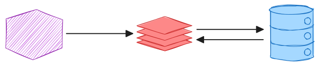

# Caching for Performance Optimization

Caching is a technique used to store and retrieve frequently accessed data to speed up future data requests. By storing data temporarily in a cache, systems can reduce the time and resources required to fetch the same data from its original source, leading to improved performance and reduced latency.

## Types of Caching

There are two broad types of caching used to optimize performance: **local** and **distributed**. 

### Local Caching

Local caching is storing data within a single machine or inside a single application. This is appropriate when data retrieval is limited to a single machine or the volume of data is low and seen in *browser caches* at the application level.

### Distributed Caching

Distributed caching involves storing data across multiple machines in a network. It is essential for applications that need to scale across multiple servers or a wide geographic area and ensures that data is available close to where it's needed. If an e-commerce web page is distributed across multiple geographic regions each with a distributed cache, each cache could hold product details for frequently requested items in a specific region, improving to users experience my ensuring faster response times for the items shoppers commonly look at.

Distributed caching addresses some of the limitations of local caching such as:
* **Scalability**: As the traffic grows, more cache servers can be added to the distributed cache without causing a distruption in other services.
* **Fault Tolerance**: If one of the cache servers fail, we can redirect requests to another server to promote availability.
* **Performance**: Distributed caches can be deployed geographically closer to the user to reduce the time needed to fetch the data resulting in faster performance.

## Cache Management

To use the cache effectively, some best practices must be used:

* **Cache Eviction**: The conditions that determine what is in the cache.
    * **Least Recently Used (LRU)**: An algorithm designed to remove the least used item when the cache is full.
    * **Time to Live (TTL)**: A time period for which the cache entry is valid. Once that time expires, the entry is removed.
* **Data Consistency**: Ensure that the cache is consistent with the primary data source, especially is situations where data is frequently updated.
* **Monitoring**: Being aware of the cache hit and miss rates to understand the effectiveness of the cache and make needed adjustments.
* **Scalability**: Design the cache to be elastic so that nodes can be added or removed from the distributed cache with web traffic.

## Cache Strategy

The strategy you deploy for your distributed cache can make a big difference in the cache effectiveness. The strategy selected should depend on data access patterns.

### Cache Aside (Lazy Loading) 

The cache sits to the side with the application talking to the cache and database directly. There is no direct communicatio between the cache and the database.

1. The data the application requested is in the cache (hit) and can be returned without going to the database.
2. The data the application requested is not in the cache (miss) so it must get it from the database.
3. The data read from the database is written to the cache.

This cache strategy works well in situations where the most of the requests are to read data. It's advantage is that it holds only data that the application requests, making effective use of the cache size. A disadvantage is data inconsistency if the application writes to the database directly without writing to the cache. A common practice is to use TTL on cache entries when writes are direct to the database.

TODO: advantage/disadvantage

### Read Through

A read-through cache sits in between the application and the database. The application goes to the cache for a read and:
1. There is a hit and the data is returned.
2. There is a miss and the cache reads the data from the database, stores the entry and returns the data to the application.

### References

* Redis Team. (n.d). _Distributed Caching_. Redis Glossary. [https://redis.io/glossary/distributed-caching/s](https://redis.io/glossary/distributed-caching/)