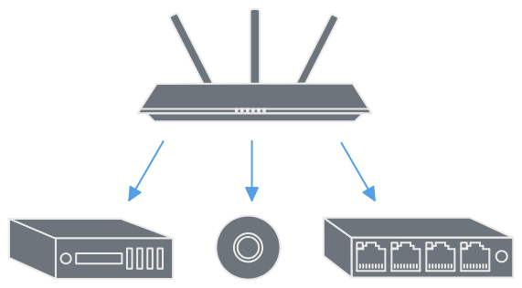

# Routers and Switches

What is a router and a switch and how do they work?

## What is a Router?

A router is a device that **connects two or more packet-switched networks or subnetworks**. It performs two primary functions:

* Managing traffic between these networks by forwarding data packets to their intended IP-Addresses.
* Allowing multiple devices to use the same internet connection.

In order to route the packets effectively, a router uses an internal routing table - a list of paths to various network destinations. A router reads a packets header to determine where it's going, then consults the routing table to figure out the most efficient path to that destination. It then forwards the packet to the next network in the path.

### The Home ISP Router

There is an important destinction between the technical definition of a networking router and a *home router*. Above is the definition of what a router technically does, connecting two or more networks and allowing internet access, but this differs from the what a *home router* is. A home router, often installed by your ISP is a **combo device** serving multiple common networking needs inside your homes LAN:

* Routing: Connecting the ISP's network to your home LAN for internet access.
* Switching: Providing physical ethernet ports for wired home devices like PC's or TV's to connect.
* Wireless Access Point: Providing wireless internet access via WiFi to devices that can send and recieve wirelessly.

Routing is just one of the jobs your home router is doing and if you broke it down phsically like in enterprise, you would see these devices set up independently.

### What Layer Does it Operate On?

A router operates at **layer 3 - the network layer** of the OSI model. It inspects the IP addresses of the incoming data packets and perform the routing function to the destination network with it's internal routing table.

## What is a Switch?

A network switch **connects devices within a network**, often a local area network, and forwards data packets to and from those devices. A switch only sends data to the devices that is intended for, which may include another switch, a router or a users computer (but not to a network of multiple devices).

### What Layer Does it Operate On?

Switches can operate at **layer 2 - the data link layer** or at **layer 3 - the network layer** of the OSI model. Layer 2 switches forward data based on the destination MAC address while the layer 3 switches forward data based on the destination IP address. Some switches can do both. Most switches are layer 2 and connect devices in their network over ethernet cables.